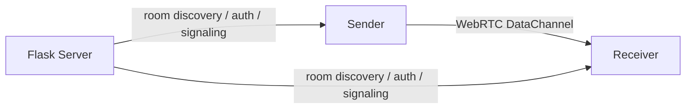

# P2P File Share

A production-quality **peer-to-peer file-sharing web application** built with
**Python Flask + Flask-SocketIO + WebRTC**, deployable to **Render's free tier**.

Files are transferred **directly between devices over WebRTC DataChannels**.
The Flask server only handles room discovery, password validation, WebRTC
signaling, and peer coordination. **No file data is uploaded or stored on the
server.**

## 1. Project overview

- Mobile → Computer, Computer → Mobile, Mobile → Mobile, Computer → Computer.
- Publicly discoverable, password-protected rooms.
- QR-code joining (no password embedded in the QR).
- Chunked, backpressured binary transfer with progress, speed, and cancel.
- Mobile-first, fully responsive UI with no build step (vanilla JS/CSS).

## 2. Features

- Create a room (send / receive / send & receive).
- Live public room listing with safe metadata only.
- Password-protected join with rate-limited attempts.
- WebRTC peer connection with STUN (and optional TURN).
- Chunked DataChannel file transfer with buffering/backpressure.
- Transfer progress, completion, and download.
- QR code that encodes `/join/<room_id>`.
- Server-side room expiration and cleanup (not browser-dependent).
- In-memory room state (rooms vanish on restart — safe for Render's ephemeral FS).

## 3. Architecture

```text
                  Flask + Socket.IO
                 Render Signaling
                       │
          ┌────────────┴────────────┐
          │                         │
       Sender                   Receiver
          │                         │
          └────── WebRTC P2P ───────┘
                    │
              File DataChannel
                    │
             Direct Transfer
```

Mermaid:



## 4. How WebRTC works

1. A user creates a room; the creator's browser listens via Socket.IO.
2. Another device scans the QR or browses rooms, enters the password.
3. The server validates the password **before** any peer connection is created.
4. Peers exchange SDP offers/answers and ICE candidates over Socket.IO.
5. A direct `RTCPeerConnection` is established using STUN to discover the
   public IP/port pairs. If STUN fails and TURN is configured, traffic falls
   back to a relay (this is disclosed in the UI).
6. Files are split into chunks and sent over a `RTCDataChannel`, then
   reassembled on the receiver.

## 5. Local installation

```bash
git clone <repo-url>
cd file-sharing-app
python3 -m venv .venv
source .venv/bin/activate
pip install -r requirements.txt
cp .env.example .env   # then edit as needed
```

## 6. Environment variables

| Variable | Default | Purpose |
| --- | --- | --- |
| `SECRET_KEY` | `dev-secret-change-me` | Flask secret. **Set a real value in production.** |
| `STUN_SERVER` | `stun:stun.l.google.com:19302` | STUN server for NAT traversal. |
| `TURN_SERVER` | `turn:openrelay.metered.ca:80` | TURN relay URL for strict/carrier NAT. |
| `TURN_USERNAME` / `TURN_PASSWORD` | `openrelayproject` | TURN credentials (free Open Relay Project). |
| `ROOM_TIMEOUT_MINUTES` | `30` | Max room life while active. |
| `ROOM_GRACE_PERIOD_SECONDS` | `300` | Orphaned-room grace period. |
| `ROOM_CLEANUP_INTERVAL_SECONDS` | `60` | Cleanup loop interval. |
| `MAX_PEERS_PER_ROOM` | `2` | Max peers per room (this build supports 1 host + 1 joiner). |
| `MAX_FILE_SIZE` | `209715200` (200 MiB) | Max individual file size (server default, client enforces too). |
| `MAX_FILES` | `50` | Max files per room. |
| `CHUNK_SIZE` | `65536` | DataChannel chunk size in bytes. |
| `PASSWORD_MAX_ATTEMPTS` | `5` | Rate-limit threshold. |
| `PASSWORD_LOCKOUT_SECONDS` | `300` | Lockout window. |
| `DEBUG` | `false` | Enable Flask debug mode. |

## 7. Running locally

```bash
source .venv/bin/activate
python app.py
# or via gunicorn (production):
gunicorn --workers 1 --worker-class gthread --threads 20 -b 0.0.0.0:8000 app:app
```

Then open `http://localhost:8000`.

## 8. Testing two devices

Use the same machine for both or two devices on the same LAN (STUN should find
a host/server-reflexive candidate on the LAN).

- **Computer → Phone:** create a room on the computer (Send Files), open the
  join URL/scan the QR on the phone, authenticate, and send.
- **Phone → Computer:** create the room on the phone, join from the computer.
- **Computer → Computer:** open two browser tabs; create the room in one and
  join from the other.

Manual test matrix:

```text
Chrome desktop    + Android Chrome
Chrome desktop    + iPhone Safari
```

For best results use Chrome/Edge/Firefox/Safari on both sides.

## 9. Render deployment

1. Push this repository to GitHub.
2. On the Render dashboard, create a new **Web Service** and connect the repo.
3. Set the **Runtime** to **Python 3**.
4. Set the **Build command**:
   `pip install -r requirements.txt`
5. Set the **Start command**:
   `gunicorn --workers 1 --worker-class gthread --threads 20 -b 0.0.0.0:$PORT app:app`
6. In the environment variables, add the values from section 6 (at minimum
   `SECRET_KEY`).
7. Render provisions an HTTPS URL automatically (e.g. `https://<name>.onrender.com`)
   — QR codes use it automatically, so no extra config is needed.
8. Deploy. The included `render.yaml` can be used for blueprint/auto-deploy if
   you prefer: Render will read it and create the service on push.

> Render's filesystem is ephemeral. This app intentionally keeps no permanent
> files on the server, so restarts only clear in-memory room state.
>
> Note: Render's free instances spin down after ~15 minutes of inactivity.
> The first request after idle triggers a cold start (a few seconds of delay)
> while the instance wakes up.
>
> **Free-tier caveat:** Render free instances also drop long-lived connections
> after ~5 minutes. The WebSocket/socket reconnect logic in `room.js` handles
> this automatically, and an active file transfer continues over the direct
> WebRTC DataChannel even if signaling drops. Still, sessions longer than
> ~5 minutes may briefly flicker "Reconnecting…" before re-authenticating.
>
> **Single-worker requirement:** rooms live in process memory, so the app must
> run with exactly **one gunicorn worker** (`--workers 1`). The included start
> command pins this; do not raise it (or set `WEB_CONCURRENCY`) or rooms will be
> split across processes and invite links will report rooms as "not active".

## 10. STUN/TURN configuration

The default config uses Google's public STUN server plus the **free Open Relay
Project** TURN relay (`openrelay.metered.ca`). This combination works across
most NATs, including mobile carrier-grade NAT where STUN alone fails.

```text
STUN_SERVER=stun:stun.l.google.com:19302
TURN_SERVER=turn:openrelay.metered.ca:80
TURN_USERNAME=openrelayproject
TURN_PASSWORD=openrelayproject
```

- STUN is sufficient for most NAT types.
- Add/replace TURN if users report "Connection failed" behind symmetric NATs or
  restrictive firewalls, or if you prefer a self-hosted coturn for reliability.

## 11. Security considerations

- Passwords are hashed with `werkzeug` (`generate_password_hash`) and never
  stored or logged in plain text.
- Passwords are never placed in QR codes or the public room listing.
- Room joining is impossible before authentication; the peer connection is only
  created after password success.
- Password attempts are rate-limited per room.
- Public metadata never exposes passwords, IPs, or internal details.
- Input is validated server-side; filenames/metadata from the browser are never
  trusted and never used for filesystem access.
- WebRTC/TURN relay usage is disclosed honestly in the UI.
- Users' IP addresses are never exposed to other users.

## 12. Limitations

- Files are **not** stored on the server — both peers must stay connected for
  the whole transfer.
- In-memory rooms are lost on server restart (acceptable for the ephemeral
  Render filesystem).
- This build supports **exactly 2 peers per room** (1 host + 1 joiner). The
  backend is structured so more peers can be wired in without a rewrite.
- File size is capped at **200 MiB** by default to keep mobile browsers from
  running out of memory during a transfer.
- Browser must support WebRTC DataChannels.

## 13. Future improvements

- Persistent room metadata via PostgreSQL.
- Native nearby-device discovery (mDNS / local network) without exposing IPs.
- Multiple simultaneous peer connections and transfers.
- Pause/resume of transfers.
- Optional TURN relay fallback with explicit disclosure.

## Development

Run the test suite:

```bash
source .venv/bin/activate
python -m pytest -q
```